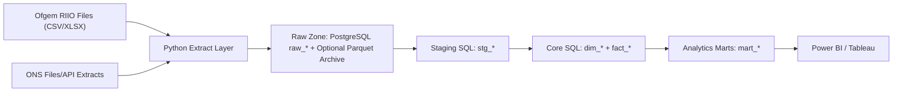

# UK Energy Analytics Platform

## Architecture

## Why ONS datasets were down-prioritized

- CPI impacts are excluded from the core model because annual ENS cannot support monthly macro linkage without high-frequency outage proxies.
- LCREE is included as a contextual, correlational trend only because annual signals are structurally confounded and unsuitable for causal attribution.
- Business energy expenditure remains secondary: useful for narrative triangulation, but weaker than energy intensity plus regional GVA for output-at-risk estimation.

## ENS to economic impact join design

- ENS remains primarily network and annual.
- ONS energy intensity is SIC-level and national.
- Regional GVA by SIC provides the missing geographic bridge.
- `core_fact_regional_gva` allocates economic structure by region-industry.
- `mart_economic_impact` applies weighted ENS allocation and computes `output_at_risk_gbp` using GVA-per-MWh proxy.

## Dashboard wireframe

- Value-for-money page: ENS per GBPm spend, RoRE vs ENS trends, allowance variance table.
- Economic impact page: map of output at risk by region, top SIC exposure bars, sector exposure scatter.
- Cross-commodity page: gas vulnerability and electricity reliability heatmaps by geography/year.
- Regulatory page: customer satisfaction, cost per customer index, and emissions scorecards.
- Decarbonisation narrative page: ENS trend overlaid with LCREE turnover, explicitly labelled non-causal.

## Dry-run operations

- Create placeholder/manual source files and validate contracts:
  - `python -m pipeline.dry_run_execution`
- Run full dry-run sequence (`ingest` -> `staging` -> `core` -> `marts`):
  - `python -m pipeline.dry_run_execution --execute`
- Source-level required column checklist:
  - `docs/data_contract_checklist.md`
