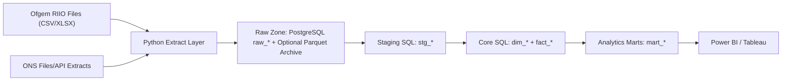

# UK Energy Analytics Platform

## Architecture

### Raw-zone naming (two parallel paths)

The repository deliberately runs **two ingest paths** that land in **different raw tables**:

| Path | Loader | Registry | Raw tables | Schema |
|------|--------|----------|------------|--------|
| CSV / JSONB sources (network indicators, ONS, daily prices) | `pipeline/ingest/load_raw.py` | `metadata/source_registry.yaml` | `raw_ofgem_ens`, `raw_ofgem_expenditure`, `raw_ofgem_rore`, `raw_ofgem_customer_metrics`, `raw_ofgem_emissions`, `raw_ons_*`, `raw_daily_market_prices` | `raw.` |
| 38-file Ofgem Data Portal XLSX + retail facet + new Renewables / WHD | `pipeline/ingest/load_xlsx.py` | `metadata/xlsx_registry.yaml` | `raw_xlsx_reliability`, `raw_xlsx_expenditure`, `raw_xlsx_rore`, `raw_xlsx_market_prices`, `raw_xlsx_market_volumes`, `raw_xlsx_generation_mix`, `raw_xlsx_supplier_metric`, `raw_xlsx_retail_timeseries`, `raw_xlsx_retail_snapshot`, `raw_xlsx_renewables`, `raw_xlsx_whd` | `public` |

Mart and dashboard prose should reference the table the loader actually writes — for example **`raw_xlsx_generation_mix`** for the quarterly fuel-mix workbook, not `raw_ofgem_generation_mix`. RoRE / expenditure / customer cost / emissions exist in **both** paths because the network-indicator CSVs and the per-RIIO-scheme XLSX workbooks are independent sources; staging joins both where possible.

## Why ONS datasets were down-prioritized

- CPI impacts are excluded from the core model because annual ENS cannot support monthly macro linkage without high-frequency outage proxies.
- LCREE is included as a contextual, correlational trend only because annual signals are structurally confounded and unsuitable for causal attribution.
- Business energy expenditure remains secondary: useful for narrative triangulation, but weaker than energy intensity plus regional GVA for output-at-risk estimation.

## ENS to economic impact join design

- ENS remains primarily network and annual.
- ONS energy intensity is SIC-level and national.
- Regional GVA by SIC provides the missing geographic bridge.
- `core_fact_regional_gva` allocates economic structure by region-industry.
- `core_fact_input_output` adds SIC-level intermediate consumption share overlays.
- `mart_economic_impact` **conserves national ENS per calendar year**: `SUM(ens_mwh)` over `core_fact_network_reliability` is computed once per year, then each region–industry row receives a share equal to its `gva_million_gbp` divided by **total national GVA** for that year (`allocation_method = national_gva_share_v1`). `output_at_risk_gbp` uses GVA-per-MWh weighted by intermediate consumption share (fallback 1.0 where missing). `sector_exposure_score` is a structural proxy (`electricity_pct_of_total_energy * energy_intensity_index`), not outage frequency.
- **HHI** for dashboards uses the **classic 0–10,000** scale (`SUM(share_pct^2)` when shares are percent). Wholesale snapshot HHI in the economic/market theme uses the same convention.
- **Cross-layer marts** (`mart_cross_layer_*`) are **associational** (same-year joins); lag columns and `is_contemporaneous_only` support exploratory comparison but do not imply causality. Wholesale drivers in `mart_cross_layer_cost_to_consumer` and `mart_cross_layer_volatility_complaints` are taken from `core_fact_market_prices` by commodity/metric, not from an unfiltered average across `mart_market_context` fuel-mix rows.

## Daily market monitoring module

- Daily gas SAP and electricity system price are ingested into `raw_daily_market_prices`.
- `stg_daily_market_prices` standardizes date/commodity/source/metric/value without joining annual reliability.
- `core_fact_daily_prices` stores daily observations for event-study and volatility analysis.
- `mart_daily_market_monitoring` provides annual volatility and spike-day summaries from daily facts.
- Frequency boundary is explicit: annual reliability/economic impact marts do not directly merge daily prices.

## DUKES Chapter 1 (macro context)

- Official statistics: [Digest of UK Energy Statistics — Chapter 1](https://www.gov.uk/government/statistics/energy-chapter-1-digest-of-united-kingdom-energy-statistics-dukes) (DESNZ).
- **Tables loaded** (subset): **1.1.4** primary energy / GDP / energy ratio; **1.1.6** expenditure by final user; **1.1.5** energy consumption by final user and fuel; **1.1.1.B** primary fuels (Mtoe).
- **Pipeline**: `metadata/dukes_registry.yaml` → downloads under `raw/<dukes_dir>/` → `pipeline/ingest/ingest_dukes.py` runs after JSONB raw ingest → fills `stg_dukes_*`. No duplication of granular ONS industry splits (`core_fact_energy_intensity` remains the SIC bridge to ENS).
- **Dashboard**: “DUKES macro context” reads `stg_dukes_*` only; overlays against Ofgem network cost proxies are illustrative.

## ONS PEFA (physical energy flow)

- Official statistics: [Physical energy flow accounts (PEFA)](https://www.ons.gov.uk/economy/environmentalaccounts/datasets/physicalenergyflowaccountspefa) (ONS environmental accounts).
- **Pipeline**: `metadata/pefa_registry.yaml` → download under `raw/<pefa_dir>/` → `pipeline/ingest/ingest_pefa.py` runs after DUKES during `ingest` → loads Tables A–D into `stg_pefa_matrix` (TJ) and Table E into `stg_pefa_bridge`.
- **Dashboard**: “ONS PEFA” reads staging only (bridge table, Table D indicators at `A_U`, Table A top rows at `A_U` for the filter end year).

## Dashboard wireframe

- Value-for-money page: ENS per GBPm spend, RoRE vs ENS trends, allowance variance table.
- Economic impact page: map of output at risk by region, top SIC exposure bars, sector exposure scatter.
- Cross-commodity page: gas vulnerability and electricity reliability heatmaps by geography/year.
- Regulatory page: customer satisfaction, cost per customer index, and emissions scorecards.
- Decarbonisation narrative page: ENS trend overlaid with LCREE turnover, explicitly labelled non-causal.

## Dry-run operations

- Create placeholder/manual source files and validate contracts:
  - `python -m pipeline.dry_run_execution`
- Run full dry-run sequence (`ingest` -> `staging` -> `core` -> `marts`):
  - `python -m pipeline.dry_run_execution --execute`
- Run retail xlsx parser smoke test (all retail registry entries must emit at least one row):
  - `python -m pipeline.dry_run_retail`
- Transform downloaded ONS Energy use: total workbook into `load_raw` contract:
  - `python scripts/transform_ons_sector_fuel_use.py <path_to_downloaded_xlsx>`
- Standard full pipeline run order:
  - `python -m pipeline.orchestrate full_refresh`
- Source-level required column checklist:
  - `docs/data_contract_checklist.md`
